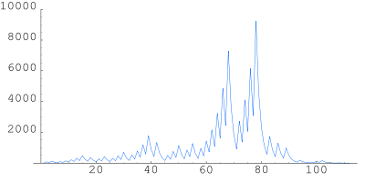

# Сиракузская последовательность

## Примеры программы

```
python Laba_6.py something
usage: Laba_6.py [-h] n
Laba_6.py: error: argument n: invalid check_positive value: 'something'

python .\Laba_6.py -3
usage: Laba_6.py [-h] n
Laba_6.py: error: argument n: -3 is an invalid positive int value

python .\Laba_6.py 3
3 10 5 16 8 4 2 1 
16

python .\Laba_6.py 21
21 64 32 16 8 4 2 1 
64
```

## График последовательности для числа 27


## Ссылка на ресурсы
[Гипотеза Коллатца](https://ru.wikipedia.org/wiki/Гипотеза_Коллатца)
